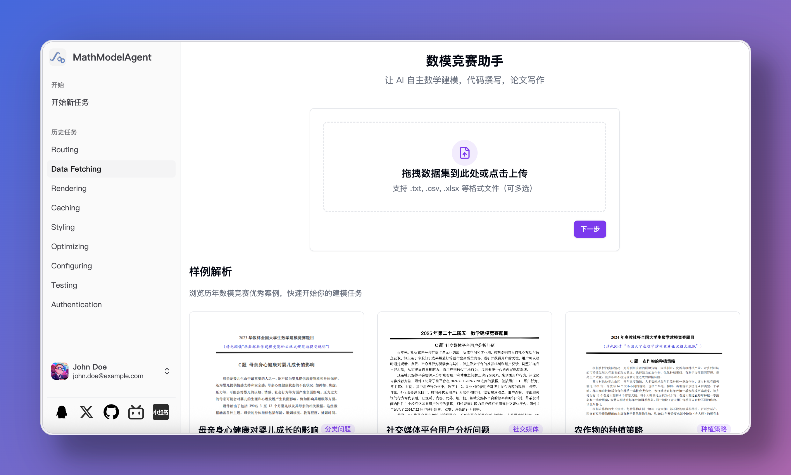
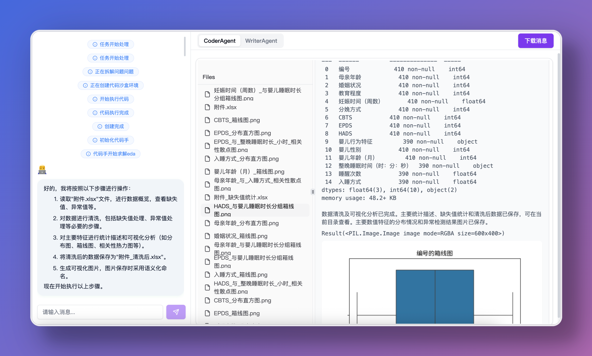
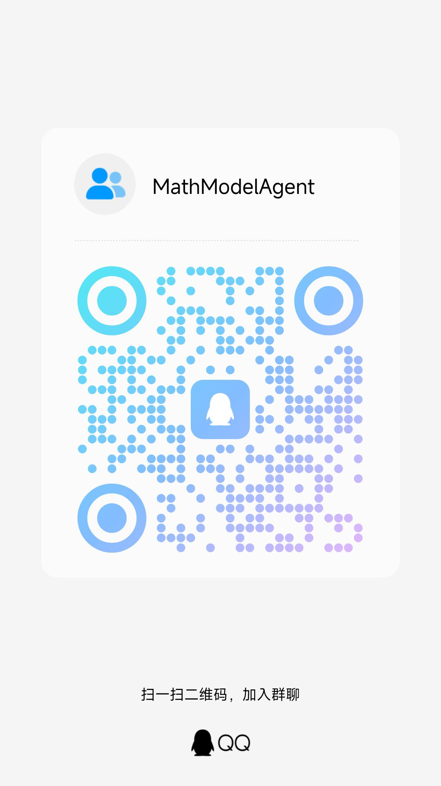

<h1 align="center">🤖 MathModelAgent 📐</h1>
<p align="center">
    
</p>
<h4 align="center">
    An agent designed for mathematical modeling<br>
    Automatically complete mathematical modeling and generate a ready-to-submit paper.
</h4>

<h5 align="center"><a href="README.md">简体中文</a> | English</h5>

## 🌟 Vision

Turn 3 days of competition into 1 hour <br>
Automatically generate an award-level modeling paper

<p align="center">
    
    
    
    
</p>

## ✨ Features

- 🔍 Automatic problem analysis, mathematical modeling, code writing, error correction, and paper writing
- 💻 Code Interpreter
    - Local Interpreter: Based on Jupyter, code saved as notebook for easy editing
    - Cloud Code Interpreter: [E2B](https://e2b.dev/) and [daytona](https://app.daytona.io/)
- 📝 Generate a well-formatted paper
- 🤝 Multi-agents: modeling expert, coding expert, paper expert, etc.
- 🔄 Multi-LLMs: Different models for each agent
- 🤖 Support for all models: [litellm](https://docs.litellm.ai/docs/providers)
- 💰 Low cost: workflow agentless, no dependency on agent framework
- 🧩 Custom templates: prompt inject for setting requirements for each subtask separately

## 🚀 Future Plans

- [x] Add and complete webui, cli
- [ ] Comprehensive tutorials and documentation
- [ ] Provide web service
- [ ] English support (MCM/ICM)
- [ ] LaTeX template integration
- [ ] Vision model integration
- [x] Proper citation implementation
- [x] More test cases
- [x] Docker deployment
- [ ] Human in loop: User interaction (model selection, @agent rewriting, etc.)
- [ ] Feedback: evaluate the result and modify
- [x] Cloud integration for code interpreter (e.g., e2b providers)
- [ ] Multi-language: R, Matlab
- [ ] Drawing: napki, draw.io, plantuml, svg, mermaid.js
- [ ] Add benchmark
- [ ] Web search tool
- [ ] RAG knowledge base
- [ ] A2A hand off: Code expert reflects on errors multiple times, hands off to smarter model agent

## Video Demo

<video src="https://github.com/user-attachments/assets/954cb607-8e7e-45c6-8b15-f85e204a0c5d"></video>

> [!CAUTION]
> The project is in experimental development stage, with many areas needing improvement and optimization. I (the project author) am busy but will update when time permits.
> Contributions are welcome.

For case references, check the [demo](./demo/) folder.
**If you have good cases, please submit a PR to this directory**

## 📖 Usage Guide

This repository is now a **backend-only** version. It keeps the multi-agent workflow and removes the frontend, WebSocket layer, and old UI-facing routes.

### 🐳 Option 1: Docker

```bash
git clone https://github.com/jihe520/MathModelAgent.git
cd MathModelAgent
docker-compose up --build
```

After startup:

- Backend API: `http://localhost:8000`
- Health check: `http://localhost:8000/health`

### 💻 Option 2: Local Deployment

> Only Python is required now. Node.js, Redis, and the frontend project are no longer needed.

```bash
cd backend
pip install uv
uv sync
```

Run the backend:

```bash
cd backend
source .venv/bin/activate # MacOS / Linux
venv\Scripts\activate.bat # Windows
ENV=DEV uvicorn app.main:app --host 0.0.0.0 --port 8000 --reload
```

### Submit a Task

Send a `multipart/form-data` request to:

- `POST /tasks/run`

Fields:

- `ques_all`: full modeling problem statement
- `comp_template`: default `CHINA`
- `format_output`: currently `Markdown` only
- `files`: optional dataset files

Follow-up APIs:

- `GET /tasks/{task_id}`: task status
- `GET /tasks/{task_id}/messages`: workflow messages
- `GET /tasks/{task_id}/artifacts`: output files

### Output Directory

Generated files are stored in `backend/project/work_dir/<task_id>/`, typically including:

- `paper.md`
- `paper.docx`
- `paper.pdf`
- `solution.ipynb`
- `solution.py`
- generated figures and intermediate files

Need to customize prompt templates?
Prompt Inject: [prompt](./backend/app/config/md_template.toml)

## 🤝 Contribution & Development

[DeepWiki](https://deepwiki.com/jihe520/MathModelAgent)

- The project is in **experimental development stage** (updated when I have time), with frequent changes and some bugs being fixed.
- Everyone is welcome to participate and make the project better.
- PRs and issues are very welcome.
- For requirements, refer to Future Plans.

After cloning the project, install the **Todo Tree** plugin to view all todo locations in the code.

`.cursor/*` contains overall architecture, rules, and mcp for easier development.

## 📄 License

Free for personal use. For commercial use, please contact me (the author).

[License](./docs/md/License.md)

## 🙏 Reference

Thanks to the following projects:
- [OpenCodeInterpreter](https://github.com/OpenCodeInterpreter/OpenCodeInterpreter/tree/main)
- [TaskWeaver](https://github.com/microsoft/TaskWeaver)
- [Code-Interpreter](https://github.com/MrGreyfun/Local-Code-Interpreter/tree/main)
- [Latex](https://github.com/Veni222987/MathModelingLatexTemplate/tree/main)
- [Agent Laboratory](https://github.com/SamuelSchmidgall/AgentLaboratory)

## Others

### 💖 Sponsor

[](https://dartnode.com "Powered by DartNode - Free VPS for Open Source")

[Buy Me a Coffee](./docs/sponser.md)

Thanks to sponsors:
[danmo-tyc](https://github.com/danmo-tyc)

### 👥 GROUP

For questions, join the group

[QQ Group: 699970403](http://qm.qq.com/cgi-bin/qm/qr?_wv=1027&k=rFKquDTSxKcWpEhRgpJD-dPhTtqLwJ9r&authKey=xYKvCFG5My4uYZTbIIoV5MIPQedW7hYzf0%2Fbs4EUZ100UegQWcQ8xEEgTczHsyU6&noverify=0&group_code=699970403)

<div align="center">
    
</div>
